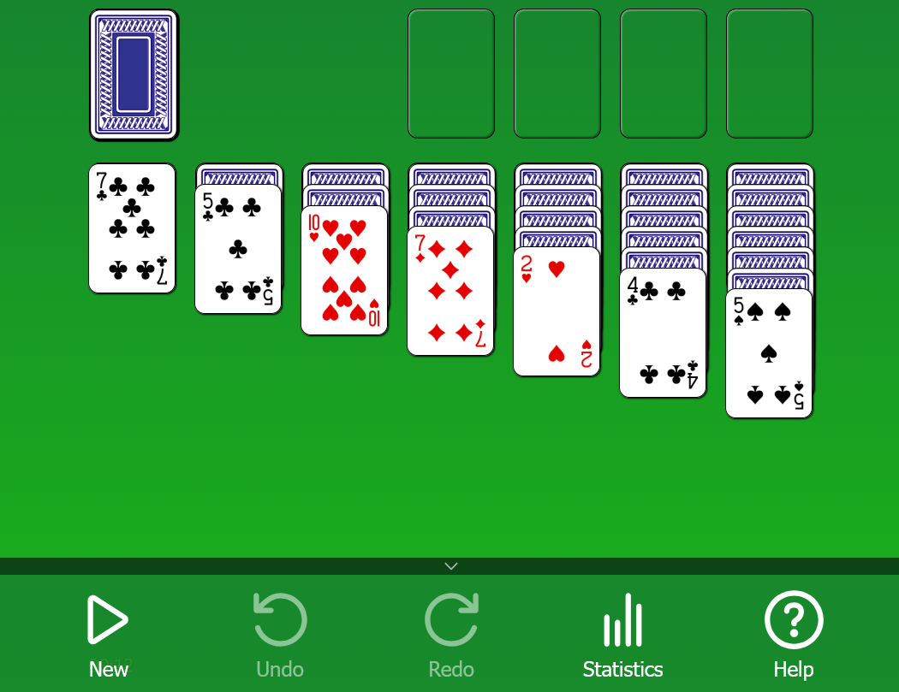

# JS React Solitaire

A simple Solitaire App written in React and TypeScript. 

Note, this is a personal project just to keep my skills current. It's not intended to be a long-term project, but I plan to add to it as inspiration strikes. 

## Available Scripts

In the project directory, you can run:

### `npm run dev`

Runs the app in the development mode. \
The page will reload automatically when code changes are made.

### `npm run preview`

Runs the app in the production mode.

### `npm run lint`

Runs eslint and stylelint and displays any lint errors in the console.

### `npm vitest`

Launches the test runner and runs all unit tests.

### `npm vitest:watch`

Launches the test runner in the interactive watch mode.

### `npm test`

Full sanity check. Runs a typecheck, all linters, all tests and a build
