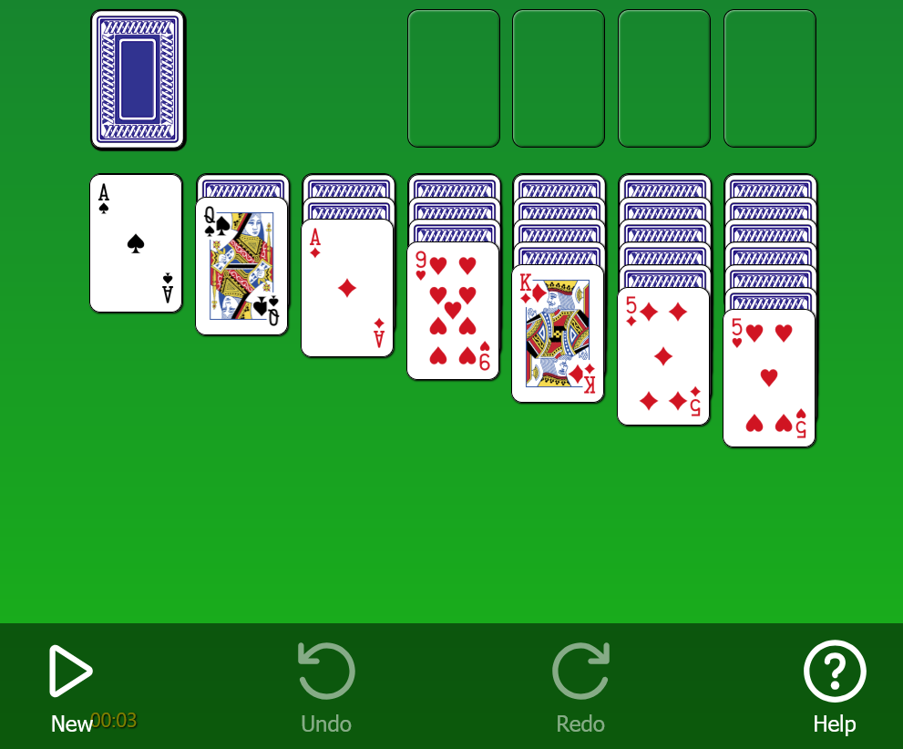

# JS React Solitaire

A simple Solitaire App written in React and TypeScript. 

Note, this is a personal project just to keep my skills current. It's not intended to be a long-term project, but I plan to add to it as inspiration strikes. 

## TODO

These are some of the changes I'm still planning to make:

- Card animation
- Configuration of game settings (e.g. timer/no-timer, card back design, etc.)
- Saving game state to local storage for resumption on next load

## Available Scripts

In the project directory, you can run:

### `npm run dev`

Runs the app in the development mode. \
The page will reload automatically when you make changes.

### `npm test`

Launches the test runner in the interactive watch mode.

### `npm run lint`

Runs the linter and displays any lint errors in the console.
